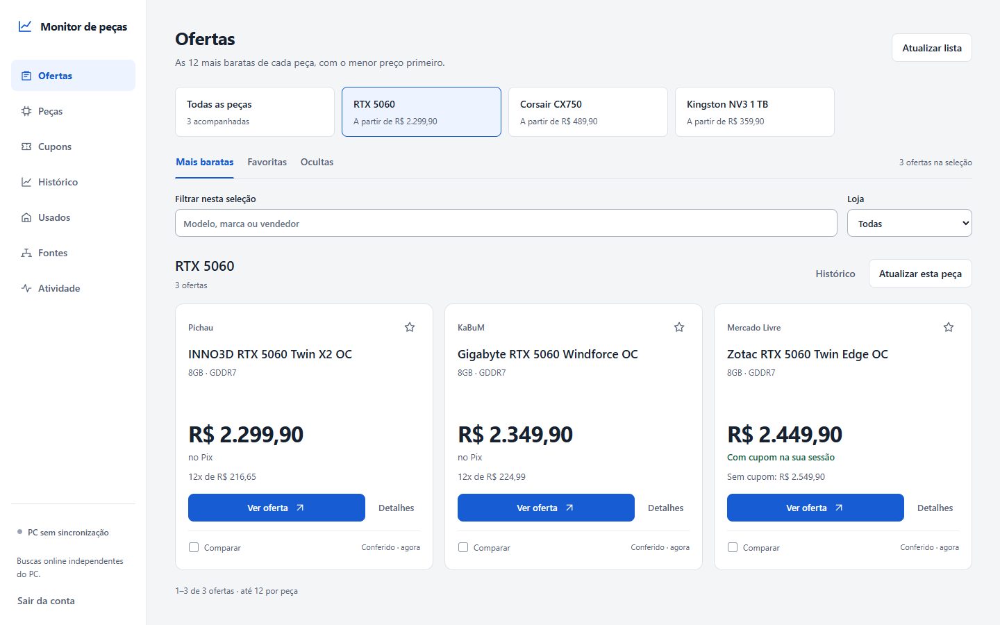

# Monitor de preços

Um painel para acompanhar as peças do seu PC, comparar ofertas e receber avisos quando o preço baixar.

[Abrir painel](https://monitor-precos-snowy.vercel.app) · [Documentação](docs/README.md) · [Histórico de mudanças](CHANGELOG.md)



*Interface do app com dados fictícios para demonstração.*

## O que você pode fazer

- Acompanhar **as 12 ofertas mais baratas de cada peça**, com filtros de preço e marca.
- Comparar Pix, cartão e preço com cupom, salvar favoritas e consultar o histórico.
- Encontrar cupons e ativar os do Mercado Livre na sua conta.
- Receber alertas no Telegram abaixo do valor que você definir e acompanhar usados na OLX.

## Começar

Abra o [painel](https://monitor-precos-snowy.vercel.app), crie sua conta e cadastre suas peças.

Para usar Mercado Livre, Shopee, OLX ou grupos do Telegram, conecte o coletor no seu PC. Requer **Windows, Python 3.12 e Google Chrome**:

```powershell
git clone https://github.com/andreltcarvalho/monitor-precos.git
cd monitor-precos
.\Instalar.cmd
.\Conectar-Nuvem.cmd
.\Iniciar-Monitor.cmd
```

O passo a passo e os logins de cada fonte estão no [guia de instalação](docs/getting-started.md) e nas [integrações](docs/integrations.md).

## Onde roda

| Na nuvem | No seu PC |
| --- | --- |
| Painel, conta e histórico | Sessões próprias do Chrome |
| Pichau, KaBuM, Amazon e Terabyte | Mercado Livre, Shopee e OLX |
| Cupons públicos e alertas no Telegram | Recebimento dos grupos e ativação de cupons do Mercado Livre |

O painel usa **FastAPI + HTML/CSS/JavaScript** na Vercel. O Supabase guarda os dados e agenda as consultas. O coletor local usa **Python, SQLite, Telethon e Playwright**. [Veja a arquitetura](docs/architecture.md).

## Documentação

[Usar o app](docs/usage.md) · [Hospedar sua instância](docs/deployment.md) · [Desenvolver e testar](docs/development.md) · [Credenciais e privacidade](docs/security.md)

As lojas podem exigir login ou bloquear consultas. O monitor distingue preço anunciado de preço conferido, informa falhas e preserva o histórico.
