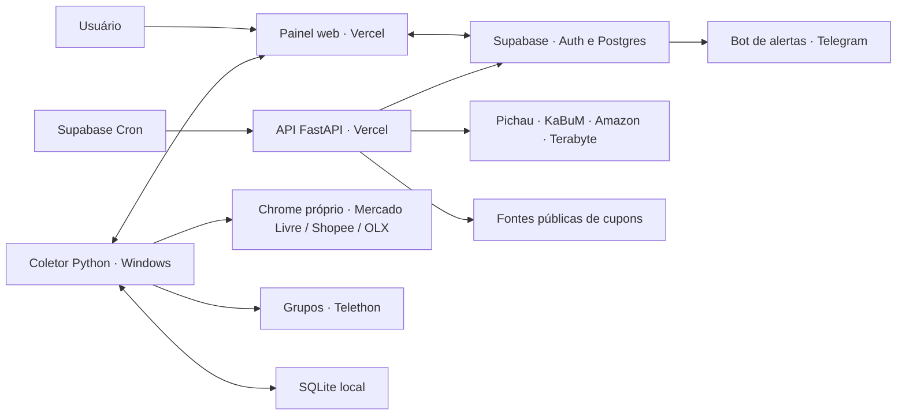

# Arquitetura

[Documentação](README.md) · [Deploy](deployment.md) · [Desenvolvimento](development.md)

## Visão geral

O projeto tem um painel web único e um coletor opcional no Windows. A nuvem executa consultas HTTP; sessões autenticadas de lojas e recebimento contínuo dos grupos ficam no PC.

## Stack

| Camada | Tecnologia |
| --- | --- |
| Interface web | HTML, CSS e JavaScript, sem framework de frontend. |
| API cloud | Python 3.12+, FastAPI, HTTPX e Beautiful Soup. |
| Autenticação e dados cloud | Supabase Auth e Postgres com Row Level Security. |
| Agendamento cloud | Supabase Cron, pg_net e Vault. |
| Coletor local | Python/asyncio, NiceGUI para iniciar o serviço local e SQLite. |
| Fontes autenticadas | Playwright com Google Chrome e perfis próprios. |
| Mensagens de grupos | Telethon. |
| Avisos | Bot API do Telegram na nuvem; Windows-Toasts no coletor. |

`app.py` mantém o processo local e `/health`; o caminho `/` redireciona para o painel de referência. `cloud/app.py` atende cada requisição, sem loop contínuo no servidor da Vercel.

## Fluxos

**Consulta online:** o painel ou o Cron chama a API, que coleta e interpreta a loja. Consultas manuais persistem pela Data API com o JWT do usuário; lotes agendados retornam leituras, e funções privadas do Supabase atribuem o proprietário e persistem o resultado. Falhas não apagam o histórico.

**Consulta com sessão:** o painel registra um comando na conta do usuário. O coletor sincroniza a fila, usa o Chrome local, publica as leituras e confirma o resultado. Com o PC offline, o pedido permanece na fila.

**Alertas:** o Supabase envia leituras e preferências para o endpoint protegido de avaliação. As regras selecionam ofertas abaixo do valor de notificação. O Supabase revalida o registro e envia pela Bot API, conservando o resultado para evitar repetição. O token do bot fica no Vault.

**Sincronização:** cadastros, preferências, ofertas e histórico circulam entre nuvem e PC. Uma lista explícita controla os campos exportados; perfis, cookies e credenciais das fontes não entram nos lotes.

## Agendamentos

| Trabalho | Cadência |
| --- | --- |
| Consulta cloud | Fila verificada a cada minuto; até duas consultas por rodada e dez minutos entre o mesmo par peça/loja. |
| Cupons públicos cloud | Verificação a cada minuto; coleta no máximo a cada hora. |
| Alertas Telegram | Avaliação a cada minuto; até um aviso por conta/minuto. |
| Sincronização do PC | A cada minuto. |
| Mercado Livre local | Por último, no ciclo automático a cada trinta minutos; atualização manual pode antecipar. |
| Shopee e buscas OLX | Ciclos locais de dez minutos. |
| Ativação de cupons ML | Ciclo local de uma hora ou botão. |

Intervalos são limites de agendamento, não garantia de entrega em tempo real. Uma fila com muitas peças e fontes lentas pode aumentar a espera. Lojas pausadas e cadastros excluídos não entram nas consultas correspondentes.

## Mapa do código

| Arquivo/pasta | Responsabilidade |
| --- | --- |
| [cloud/](../cloud/) | API, frontend, acesso Supabase e SQL. |
| [core.py](../core.py) | Persistência local e regras de identificação, agrupamento, preço e validade. |
| [monitor.py](../monitor.py) | Orquestração dos ciclos locais e avisos do Windows. |
| [cloud_sync.py](../cloud_sync.py), [cloud_protocol.py](../cloud_protocol.py) | Ponte local/cloud e contrato de dados públicos. |
| [shops.py](../shops.py) | Parsers e consultas HTTP das lojas e cupons. |
| [mercado_livre_browser.py](../mercado_livre_browser.py), [shopee_browser.py](../shopee_browser.py) | Perfis e coleta com sessão. |
| [ml_coupon_applicator.py](../ml_coupon_applicator.py) | Ativação e estados dos cupons ML. |
| [olx.py](../olx.py), [olx_ui.py](../olx_ui.py) | Busca e apresentação dos usados. |
| [presentation.py](../presentation.py), [forms.py](../forms.py) | Apresentação e validação dos formulários. |
| [scripts/](../scripts/README.md), [tests/](../tests/README.md) | Diagnósticos manuais e validação automatizada. |

A estrutura do código e os entrypoints foram mantidos. Planos e evidências anteriores ficam no [arquivo histórico](archive/README.md).
